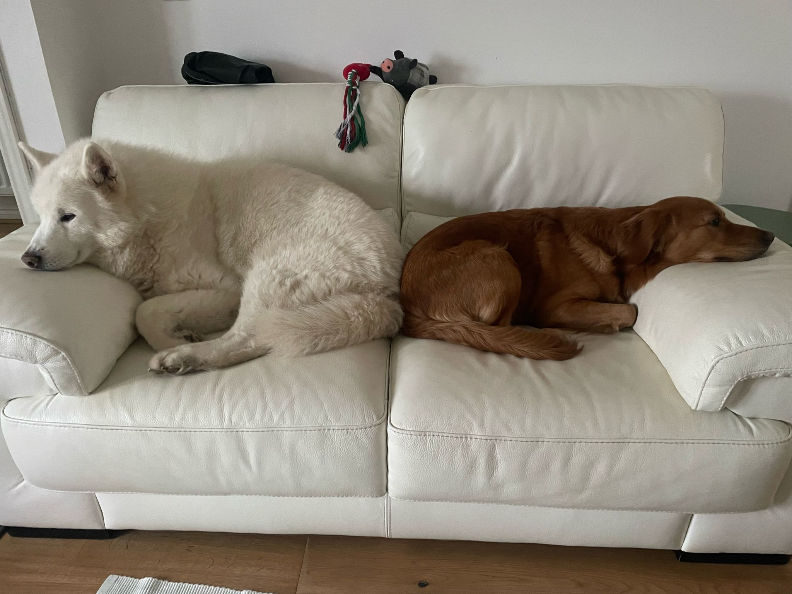

# Markdown Catalog

# Big title "#"

## Not so big title "##"

### Average title "###"
---
#### Below Average title "####"
---
##### Small title "#####"
---

    I am text box
---
**I am bold text** 

*I am italic*

***I am bold italic***
>I am block of text

#### I am underline "---"
---
[I am link "[]"](https://github.com/ChonCanCode)



`//Code box`

```
Big code box
```

1. First option

    1. Sub option
    2. Sub option

2. Second option
    - Bullet Point
    - Bullet Point
        - More point

| First column | Second column | Third column |
|--------------|---------------|--------------|
|      1       |        2      |  3           |

~~To Cross~~

